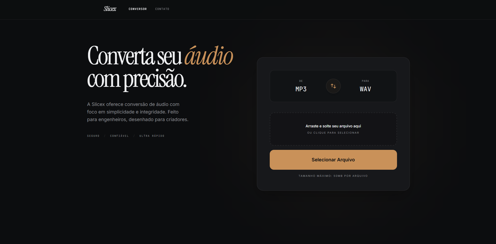
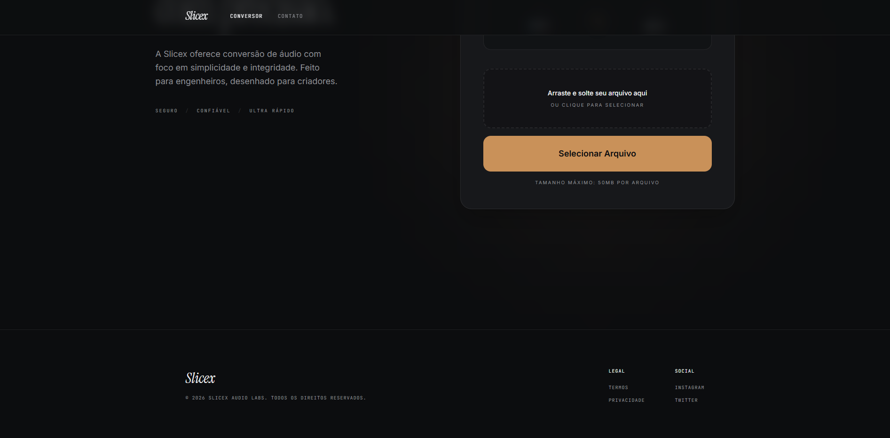
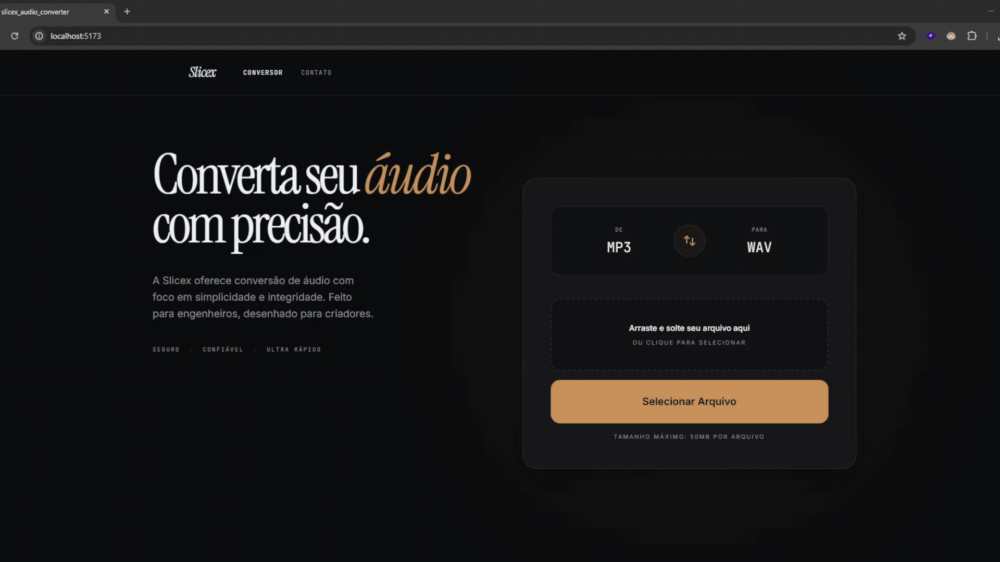
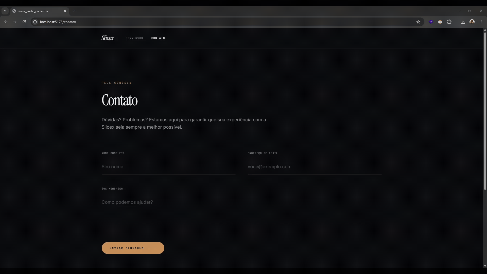

# 🎵 Slicex Audio Converter


Aplicação web de conversão de áudio desenvolvida com **Spring Boot** no backend e **React + TypeScript** no frontend.

O projeto permite converter arquivos **MP3 para WAV** e **WAV para MP3**, utilizando **FFmpeg** no backend e uma interface web com upload por clique ou **drag and drop**.

---

## Imagens e vídeos demonstrativos


_Primeira visualização da página inicial._


_Interface principal do conversor._


_Exemplo arrastando um arquivo para a área de upload, convertendo e baixando o resultado._


_Exemplo da página de contato._

---

## Objetivo

Este projeto foi desenvolvido para praticar a construção de uma aplicação **full stack**, integrando uma API REST em Java com uma interface moderna em React.

O foco principal foi trabalhar com:

- Upload de arquivos
- Validação de dados no frontend e backend
- Processamento assíncrono com fila
- Integração com ferramenta externa via backend
- Tratamento de erros para melhorar a experiência do usuário

---

## Funcionalidades

- **Converter MP3 para WAV**
- **Converter WAV para MP3**
- **Enviar arquivos por clique ou drag and drop**
- **Consultar status da conversão**
- **Baixar o arquivo convertido**
- **Exibir mensagens amigáveis para erros esperados**

---

## Tecnologias Utilizadas

### Backend

- **Java 21**
- **Spring Boot**
- **Spring Web MVC**
- **Spring Validation**
- **Maven**
- **FFmpeg**
- **JUnit**
- **OpenAPI/Swagger**

### Frontend

- **React**
- **TypeScript**
- **Vite**
- **React Router**
- **Tailwind CSS**

---

## Arquitetura

O projeto foi dividido em duas aplicações principais:

- `backend` → API REST responsável por validar arquivos, criar jobs de conversão, processar áudio com FFmpeg e disponibilizar o download.
- `frontend` → Interface web responsável pelo upload, seleção de formatos, polling do status da conversão e download do arquivo convertido.

No backend, a conversão é processada de forma assíncrona usando uma fila em memória. Cada conversão recebe um `jobId`, permitindo que o frontend consulte o status até o arquivo ficar pronto.

---

## Fluxo de Conversão

O fluxo principal da aplicação segue o padrão:

**Upload → API → Fila → FFmpeg → Status → Download**

1. O usuário seleciona ou arrasta um arquivo para a interface.
2. O frontend envia o arquivo e os formatos escolhidos para a API.
3. O backend valida o arquivo e adiciona a conversão em uma fila.
4. O FFmpeg processa o arquivo em segundo plano.
5. O frontend consulta o status da conversão.
6. Quando finalizado, o usuário pode baixar o arquivo convertido.

---

## Tratamento de Erros

O projeto trata erros esperados tanto no frontend quanto no backend, exibindo mensagens claras para o usuário.

### Formato de entrada diferente do arquivo enviado

Exemplo: escolher conversão de MP3 para WAV, mas enviar um arquivo WAV.


### Arquivo incompatível

Exemplo: enviar qualquer arquivo que não seja MP3 ou WAV.


### Arquivo muito grande

Arquivos acima de **50 MB** são bloqueados.


### Servidor indisponível

Erro exibido quando o frontend não consegue se comunicar com o backend.


---

## Como Rodar

O FFmpeg precisa estar instalado e disponível no `PATH`.

### Backend

```bash
cd backend
mvnw.cmd spring-boot:run
```

Backend:

```text
http://localhost:8080
```

### Frontend

```bash
cd frontend
npm install
npm run dev
```

Frontend:

```text
http://localhost:5173
```

---

## 🔧 Melhorias Futuras

- [ ] Implementar **rate limiting por IP** para evitar abuso da API.
- [ ] Adicionar **histórico de conversões** para o usuário.
- [ ] Suportar **mais formatos de áudio** além de MP3 e WAV.

---

## Autor

Desenvolvido por **João Victor**.

- [LinkedIn](https://www.linkedin.com/in/joao-victor-moreira-almeida/)
- [GitHub](https://github.com/vavito)
